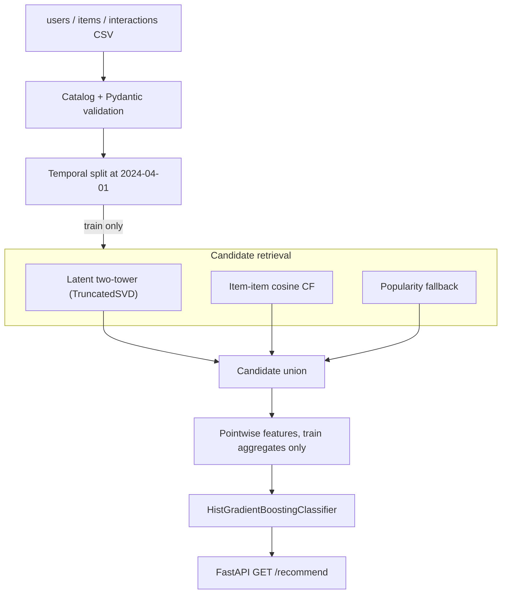

# Savor recommendation backend

[](https://github.com/taiyuz/savor-recommendation-system/actions/workflows/ci.yml)

Python recsys backend: **retrieve** a candidate set (latent two-tower, item-item CF, popularity), **rank** those candidates with user–item features, **serve** `GET /recommend`. Offline eval is recall@k, NDCG@k, and MRR@k on a temporal split; coverage@k is the popularity-bias check; item-cold-start coverage is the fraction of train-cold catalog items that still appear in a top-k. Cold start, train/valid leakage, view-as-positive labels, inverted ranking, and dropped cold-item labels are guarded in pytest, not just described.

This is the retrieval / ranking / serving stack for [Savor](https://github.com/taiyuz/Authentication-and-ML), a Pittsburgh food product the iOS apps never actually shipped. It is not a notebook, and it is not a port of [savourapp](https://github.com/taiyuz/savourapp).

The checked-in catalog is **synthetic**. Restaurant names mix well-known Pittsburgh places with invented ones so the catalog is large enough to rank. Interactions are sampled from a preference model (cuisine, price, neighborhood, dietary constraints, popularity). Treat the eval table as a sanity check that the pipeline is wired correctly, not as a production metric.

## Problem

A user opens Savor and should see restaurants they might actually visit, not a city-wide top-N list.

That breaks into three jobs:

1. **Retrieve** a few dozen plausible candidates without scoring the whole world (here the world is 98 restaurants; the same interfaces would take a sparse index at 10k+).
2. **Rank** those candidates with user–item features.
3. **Serve** `GET /recommend?user_id=` fast enough to sit behind an iOS client.

Cold-start users (new account, no events) and cold-start items (listed, never interacted) are first-class. Popularity is the fallback, not the product.

## Architecture



Retrieval and ranking are fit on the **train** slice for evaluation. The serving process fits on the full sample so a demo request uses every checked-in event.

Views are weak implicit feedback for retrieval weights (`view=1, save=3, visit=5`). The ranker labels **save/visit only**. Using views as positives would inflate metrics and teach the model to rank anything the user scrolled past. Held-out eval labels are the same cut: a valid-period view is not a positive.

## Data

| table | n | notes |
| --- | --- | --- |
| `data/sample/users.csv` | 220 | neighborhood, cuisine prefs, price band, dietary |
| `data/sample/items.csv` | 98 | Pittsburgh neighborhoods, cuisine, price, diet flags, lat/lon |
| `data/sample/interactions_part*.csv` | 1,366 | `view` / `save` / `visit` from 2024-01-15 to 2024-04-15 |

The loader concatenates the two interaction shards so the sample stays GitHub-friendly. 18 users have no events (true cold start). Two restaurants have no events (item cold start). Regenerating the CSVs:

```bash
python scripts/generate_sample.py
```

Seed is fixed at 42. Point the loader at another directory with `SAVOR_DATA_DIR` (CI does this so a fresh checkout still finds `data/sample`).

## Tests and API

Python 3.12+. [`uv`](https://docs.astral.sh/uv/) is the intended installer; pip works too.

```bash
uv venv
uv pip install -e ".[dev]"

# tests (CI sets SAVOR_DATA_DIR; locally the loader also finds data/sample)
pytest
ruff check src tests && ruff format --check src tests
```

```bash
# one recommendation, then the HTTP server
python -m savor recommend u0042
python -m savor serve
# GET http://127.0.0.1:8000/health
# GET http://127.0.0.1:8000/recommend?user_id=u0042&k=10
```

Docker:

```bash
docker build -t savor-recs .
docker run -p 8000:8000 savor-recs
```

Unknown `user_id` → HTTP 404. Known user with no history → `strategy: cold_start_popularity`.

## Evaluation (synthetic sample)

Time split: train = events strictly before **2024-04-01**, valid = on or after. Ground truth is a valid-period **save/visit** whose `(user_id, item_id)` pair never appeared in train. Views in the valid slice are not labels. That is a discovery task, not "predict that they go back to the same place."

Fit retrieval and the ranker on train only. Score the users who have both train history and held-out positives. `k=10`.

Recall@k is position-insensitive inside the window. NDCG@k discounts every hit. **MRR@k is first-hit only**: a relevant item at rank 1 scores 1.0, at rank k scores 1/k, at rank k+1 scores 0. Pytest checks those definitions (and that IDCG truncates when `|relevant| > k`). It does **not** freeze a leaderboard cell.

**Item-cold-start coverage** is the fraction of catalog items with zero train events that still appear in any top-k. Collaborative retrieval has no support for those ids; a first visit after the cutoff is still a held-out label (dropping it would fake recall). Pytest pins `n_cold_items >= 2` and that item-item does not return them after a train-only fit. It does **not** pin a shown-coverage number — a zero-score popularity pad can surface a listed-but-unseen restaurant without that being a quality win.

The **stable** signal on this generator is coverage: popularity hugs the head, two-stage does not. Pytest pins `coverage@10 > 0.8` vs popularity `< 0.4`, plus mean MRR@10 in `(0, 1]`. Two-stage NDCG jitter vs popularity (HistGradientBoosting on 98 items) and is **not** pinned above the baseline — pinning it was a fake win.

Popularity numbers are stable across runs. Two-stage recall/NDCG move; `python -m savor evaluate` prints the current draw. One observed popularity row:

| model | recall@10 | ndcg@10 | coverage@10 |
| --- | ---: | ---: | ---: |
| popularity baseline | 0.144 | 0.085 | 0.153 |
| two-stage (SVD + item-item + HGB) | (run `evaluate`) | (run `evaluate`) | > 0.8 (pytest) |

MRR@10 is in the CLI JSON (`two_stage.mrr` / `popularity.mrr`). Item-cold-start counts are under `item_cold_start` (`n_cold_items`, `label_fraction`, shown coverage). No invented NDCG cell.

Re-run:

```bash
python -m savor evaluate
```

## Rec-sys pitfalls this repo actually encodes

**Leakage.** A random interaction split would put a user's Thursday visit into the features that rank their Wednesday feed. Popularity, SVD factors, item-item neighbors, cuisine affinity, and user activity are all computed on train timestamps only. Tests assert the cutoff, assert no shared rows, assert future-only items have zero train popularity, and assert `log_user_activity` does not count valid-period events. Ranked lists with `exclude_seen=True` cannot contain the user's train items.

**Weak labels.** A valid-period `view` is not a held-out positive. A three-row synthetic log (view, visit, view-of-a-train-item) is fed to `held_out_positives`; only the visit is labeled. Treating scroll events as visits would inflate recall/NDCG/MRR.

**Inverted ranking.** `recommend()` must return scores in non-increasing order. A test compares the list to `sorted(scores, reverse=True)` so `np.argsort(scores)` (ascending) cannot sneak in.

**Popularity bias.** Interactions are drawn with `popularity ** 0.35`, so head restaurants still get more traffic (as they do in any city) without wiping out personalization. Coverage@10 is the honest report of how badly a model clings to the head. Pairing it with recall/ndcg/mrr is the point: a model can "win" recall by recommending Primanti's to everyone.

**Cold start.** Users with no history cannot have a two-tower row that means anything. They get popularity, still filtered by `exclude_seen` (empty) and still passed through the ranker so dietary / cuisine / distance features can move the list. The API labels that path `cold_start_popularity`. Items with no train events have zero CF score and zero popularity; item-item `top()` will not return them. A synthetic log where two users share a warm item in train and both visit a new item after cutoff would make that new item a co-occurring neighbor if `fit()` saw the concat — pytest fits on train only and asserts it does not. Held-out visits to train-cold items stay in the label set so recall pays for the miss.

## Layout

```
src/savor/
  data/          schema, Polars loader, temporal split, train-cold items
  retrieval/     SVD two-tower, item-item, popularity, union
  ranking/       feature builder, HistGradientBoosting
  api/           FastAPI app
  pipeline.py    Recommender.fit / recommend
  evaluate.py    recall@k, NDCG@k, MRR@k, coverage, item-cold-start coverage
  metrics.py     metric definitions (first-hit MRR, truncated IDCG, cold-item coverage)
  cli.py         python -m savor recommend|evaluate|serve
data/sample/     checked-in synthetic CSVs (interaction log is sharded)
tests/           leakage, cold start, metrics, ranking order, retrieval, API contract
```

## Limitations

- Catalog scale is a demo. Dense cosine and dense SVD are fine at 98 items; they are not an ANN story.
- The "two-tower" is matrix factorization (TruncatedSVD + dot product), not trained embeddings with in-batch negatives. Calling it a deep two-tower would be a lie.
- No session features, no time-of-day, no friend graph, no geo-fence beyond neighborhood distance.
- Pointwise logistic boosting, not listwise LambdaMART.
- Offline ranking metrics on synthetic labels. No A/B test, no logged policy. Two-stage NDCG is not a stable win over popularity here.

MIT. Original work, 2026.
